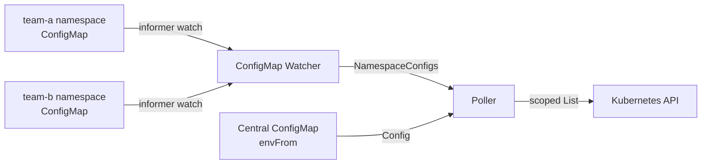

# Per-Namespace ConfigMaps

xp-tracker supports **per-namespace ConfigMap discovery**, allowing teams to opt into GVR monitoring by creating labeled ConfigMaps in their own namespaces. This enables a self-service model where the platform team doesn't need to update the central configuration every time a new team or resource type is onboarded.

## How it works

1. Teams create a ConfigMap in their namespace with the label `xp-tracker.kanzi.io/config: "gvrs"`.
2. xp-tracker watches for these ConfigMaps across all namespaces using a Kubernetes informer.
3. Claims defined in a namespace ConfigMap are polled **only within that namespace**.
4. XRs defined in a namespace ConfigMap are polled **cluster-wide** (since Crossplane XRs are cluster-scoped).
5. Changes to ConfigMaps are detected automatically -- no restart required.



## ConfigMap format

A per-namespace ConfigMap must:

- Have the label `xp-tracker.kanzi.io/config: "gvrs"`
- Contain at least one of `CLAIM_GVRS` or `XR_GVRS`

```yaml
apiVersion: v1
kind: ConfigMap
metadata:
  name: xp-tracker-gvrs           # any name
  namespace: team-a                # claims scoped to this namespace
  labels:
    xp-tracker.kanzi.io/config: "gvrs"
data:
  # Required: at least one of CLAIM_GVRS or XR_GVRS.
  CLAIM_GVRS: "platform.example.org/v1alpha1/postgresqlinstances"
  XR_GVRS: "platform.example.org/v1alpha1/xpostgresqlinstances"

  # Optional: override annotation keys (falls back to central config).
  CREATOR_ANNOTATION_KEY: "platform.example.org/created-by"
  TEAM_ANNOTATION_KEY: "platform.example.org/team"
```

A sample ConfigMap is included at `deploy/base/sample-namespace-configmap.yaml`.

## Supported fields

| Field | Required | Description |
|---|---|---|
| `CLAIM_GVRS` | At least one of `CLAIM_GVRS` or `XR_GVRS` | Comma-separated claim GVRs to poll in this namespace |
| `XR_GVRS` | At least one of `CLAIM_GVRS` or `XR_GVRS` | Comma-separated XR GVRs to poll cluster-wide |
| `CREATOR_ANNOTATION_KEY` | No | Override the creator annotation key (falls back to central config) |
| `TEAM_ANNOTATION_KEY` | No | Override the team annotation key (falls back to central config) |

!!! note "Only GVRs and annotation keys are configurable per-namespace"
    Settings like `POLL_INTERVAL_SECONDS`, `METRICS_ADDR`, `STORE_BACKEND`, and `COMPOSITION_LABEL_KEY` remain central-only. Per-namespace ConfigMaps cannot override them.

## Scoping rules

### Claims are namespace-scoped

When a namespace ConfigMap defines `CLAIM_GVRS`, those GVRs are only polled within that ConfigMap's namespace. This ensures team-a's ConfigMap can't accidentally pull in team-b's claims.

### XRs are cluster-wide

Crossplane composite resources (XRs) are cluster-scoped. When a namespace ConfigMap defines `XR_GVRS`, those GVRs are polled across the entire cluster, regardless of which namespace the ConfigMap lives in.

### Deduplication with central config

If a GVR appears in both the central config (`CLAIM_GVRS`/`XR_GVRS` environment variables) and a namespace ConfigMap, the **central config takes priority**. The namespace ConfigMap's GVR is silently skipped to avoid double-counting.

This means teams can safely list GVRs in their namespace ConfigMaps even if the platform team later adds the same GVR to the central config -- no conflict or duplication will occur.

## Annotation key inheritance

Per-namespace ConfigMaps can override `CREATOR_ANNOTATION_KEY` and `TEAM_ANNOTATION_KEY`. If a namespace ConfigMap omits these fields, it inherits the values from the central config.

This is useful when different teams use different annotation conventions:

```yaml
# team-a uses the platform-standard annotation
apiVersion: v1
kind: ConfigMap
metadata:
  name: xp-tracker-gvrs
  namespace: team-a
  labels:
    xp-tracker.kanzi.io/config: "gvrs"
data:
  CLAIM_GVRS: "platform.example.org/v1alpha1/postgresqlinstances"
  # No CREATOR_ANNOTATION_KEY -- inherits from central config
```

```yaml
# team-b uses a custom annotation
apiVersion: v1
kind: ConfigMap
metadata:
  name: xp-tracker-gvrs
  namespace: team-b
  labels:
    xp-tracker.kanzi.io/config: "gvrs"
data:
  CLAIM_GVRS: "platform.example.org/v1alpha1/kafkatopics"
  CREATOR_ANNOTATION_KEY: "team-b.example.org/owner"
```

## Hot reload

The ConfigMap watcher uses a Kubernetes informer, so changes are detected in real time:

- **Add** a new ConfigMap: its GVRs are polled starting from the next cycle.
- **Update** an existing ConfigMap: the configuration is re-parsed and takes effect on the next cycle.
- **Delete** a ConfigMap: its GVRs are removed from polling and stale data is cleaned up on the next cycle.

No restart or SIGHUP is required.

## Central config is now optional for GVRs

With per-namespace ConfigMaps, the central `CLAIM_GVRS` and `XR_GVRS` environment variables are **no longer required**. This supports deployments where all GVR configuration is driven entirely by namespace ConfigMaps.

You can mix and match:

- **Central only** -- traditional mode, all GVRs in environment variables.
- **Namespace only** -- no `CLAIM_GVRS`/`XR_GVRS` in the central config; each team manages their own.
- **Hybrid** -- some GVRs centrally configured, others delegated to namespace ConfigMaps.

## RBAC

The exporter needs `get`, `list`, and `watch` permissions on ConfigMaps across all namespaces. The base ClusterRole already includes this. If you scope down RBAC for production, ensure ConfigMap access is preserved:

```yaml
rules:
  # Your Crossplane resource rules...
  - apiGroups: ["platform.example.org"]
    resources: ["postgresqlinstances", "xpostgresqlinstances"]
    verbs: ["get", "list", "watch"]
  # ConfigMap access for per-namespace discovery
  - apiGroups: [""]
    resources: ["configmaps"]
    verbs: ["get", "list", "watch"]
```

See [RBAC](../deployment/rbac.md) for the full RBAC reference.

## Self-monitoring

The `xp_tracker_namespace_configs` gauge reports the number of active per-namespace ConfigMap configurations. This is updated each poll cycle and is useful for alerting when expected namespace configs disappear.

```promql
# Number of active namespace configs
xp_tracker_namespace_configs

# Alert if namespace configs drop to zero (when you expect some)
xp_tracker_namespace_configs == 0
```

## Troubleshooting

### Namespace ConfigMap is not being picked up

- Verify the label is exactly `xp-tracker.kanzi.io/config: "gvrs"` (both key and value must match).
- Check the exporter logs for parse errors: `kubectl logs -n crossplane-system deploy/crossplane-metrics-exporter | grep "namespace config"`.
- Ensure the ConfigMap has at least one of `CLAIM_GVRS` or `XR_GVRS` with a valid GVR format.

### Claims from another namespace appear

- This should not happen. Per-namespace claim GVRs are scoped to the ConfigMap's namespace. If you see claims from other namespaces, check whether the same GVR is also in the central `CLAIM_GVRS`.

### GVR appears in both central and namespace config

- The central config takes priority. The namespace ConfigMap's GVR is skipped. A debug-level log message is emitted. This is by design to prevent double-counting.

### ConfigMap changes not taking effect

- Changes are detected by an informer and take effect on the next poll cycle (default: 30 seconds). Check logs for `"namespace config updated"` messages.
