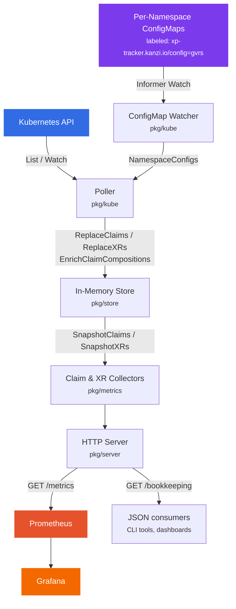

---
hide:
  - navigation
---

# xp-tracker

<p align="center">
  <a href="https://github.com/kanzifucius/xp-tracker/releases/latest"></a>
  
  
  
</p>

A minimal, read-only Prometheus exporter for [Crossplane](https://www.crossplane.io/) claims and composite resources (XRs).

It polls the Kubernetes API via the dynamic client, aggregates resource counts by meaningful labels, and exposes them as Prometheus gauge metrics on `/metrics`.

## Why xp-tracker?

### The gap in standard Crossplane metrics

Crossplane ships with controller-level Prometheus metrics out of the box -- reconcile duration, workqueue depth, API request latency, and similar operational signals. These are valuable for monitoring the health of the Crossplane controllers themselves, but they don't answer the questions platform teams actually ask:

- *How many claims exist per namespace?*
- *Who created them?*
- *Which team owns them?*
- *Which compositions are most popular?*
- *Is adoption growing over time?*

Standard Crossplane metrics have no concept of **creator**, **team**, **composition breakdown**, or **per-namespace inventory counts**. That is the gap xp-tracker fills.

### What xp-tracker adds

**Business-level dimensions**
:   Every metric is broken down by `creator`, `team`, `namespace`, and `composition`. These are the dimensions that matter when you're running a platform, not just an operator.

**Inventory and adoption tracking**
:   Get real answers to "how many claims of each type exist?", "which namespaces are using the platform?", and "which compositions are most adopted?" -- all via standard PromQL queries and Grafana dashboards.

**Chargeback and showback**
:   The `creator` + `team` + `namespace` labels make it straightforward to build cost-allocation or usage-reporting dashboards per team or business unit.

**Dynamic, zero-codegen**
:   Works with any Crossplane CRD without code generation or recompilation. Just configure your GVRs as environment variables and deploy.

**JSON bookkeeping endpoint**
:   Beyond Prometheus, the `/bookkeeping` endpoint returns a full snapshot of all tracked resources as JSON. Useful for CLI tooling, external integrations, audit trails, or any consumer that doesn't want to go through PromQL.

### Standard Crossplane metrics vs xp-tracker

| Dimension | Crossplane built-in | xp-tracker |
|---|---|---|
| Reconcile latency / errors | :material-check: | -- |
| Workqueue depth | :material-check: | -- |
| Claim count by namespace | -- | :material-check: |
| Claim count by creator | -- | :material-check: |
| Claim count by team | -- | :material-check: |
| Readiness ratio by composition | -- | :material-check: |
| XR count by kind / composition | -- | :material-check: |
| JSON resource inventory | -- | :material-check: |

!!! tip "In short"
    Crossplane tells you how the *controller* is doing. xp-tracker tells you what *resources* exist, who owns them, and whether they're healthy -- the information platform teams need to run an internal developer platform.

### Pairs well with kindplane

[kindplane](https://github.com/kanzifucius/kindplane) is a companion CLI tool that bootstraps [Kind](https://kind.sigs.k8s.io/) clusters pre-configured with Crossplane, cloud providers, and Helm charts -- all with a single command. If you're evaluating xp-tracker or developing Crossplane compositions locally, kindplane is the fastest way to get a working environment:

```bash
# One command to get a local Crossplane cluster
kindplane up

# Deploy xp-tracker and start exploring metrics
kubectl apply -k deploy/base
curl -s localhost:8080/metrics | grep crossplane_
```

Together, the two tools cover the full local platform-engineering workflow: **kindplane** provisions the cluster and Crossplane stack, **xp-tracker** gives you visibility into the resources running on it.

## How it works



## Key features

- :material-shield-lock-outline: **Read-only** -- only `get`, `list`, and `watch` operations against the Kubernetes API. Never creates, updates, or deletes resources.
- :material-auto-fix: **Dynamic client** -- works with any Crossplane CRD without code generation. Configure GVRs via environment variables.
- :material-folder-multiple-outline: **Per-namespace ConfigMaps** -- teams can opt into monitoring by creating labeled ConfigMaps in their own namespaces, with hot reload via Kubernetes informers. See [Per-Namespace ConfigMaps](configuration/namespace-configmaps.md).
- :material-chart-bar: **Claim metrics** -- total and ready counts broken down by group, kind, namespace, composition, creator, and team.
- :material-chart-donut: **XR metrics** -- total and ready counts broken down by group, kind, namespace, and composition.
- :material-link-variant: **Composition enrichment** -- claims are enriched with their composition name by following `spec.resourceRef` to the backing XR.
- :material-code-json: **Bookkeeping endpoint** -- JSON snapshot of all tracked resources at `GET /bookkeeping` for debugging and integrations.
- :material-swap-horizontal: **Pluggable store** -- the in-memory data layer is behind a `store.Store` interface. An S3-backed persistent store is included for surviving restarts.
- :material-feather: **Lightweight** -- single binary, ~10 MB distroless container image, minimal resource footprint.
- :material-chip: **Multi-arch** -- container images built for `linux/amd64` and `linux/arm64`.

## Next steps

<div class="grid cards" markdown>

- :material-download: **[Installation](getting-started/installation.md)**

    ---

    Get xp-tracker running in your cluster

- :material-cog: **[Configuration](configuration/environment-variables.md)**

    ---

    All environment variables and their defaults

- :material-gauge: **[Metrics Reference](metrics/reference.md)**

    ---

    The four Prometheus gauges and their labels

- :material-kubernetes: **[Deployment](deployment/kustomize.md)**

    ---

    Kustomize base and overlays

- :material-code-json: **[Bookkeeping API](api/bookkeeping.md)**

    ---

    JSON endpoint for debugging and integrations

- :material-chart-line: **[Grafana Queries](metrics/grafana-queries.md)**

    ---

    Example PromQL queries for dashboards

</div>
